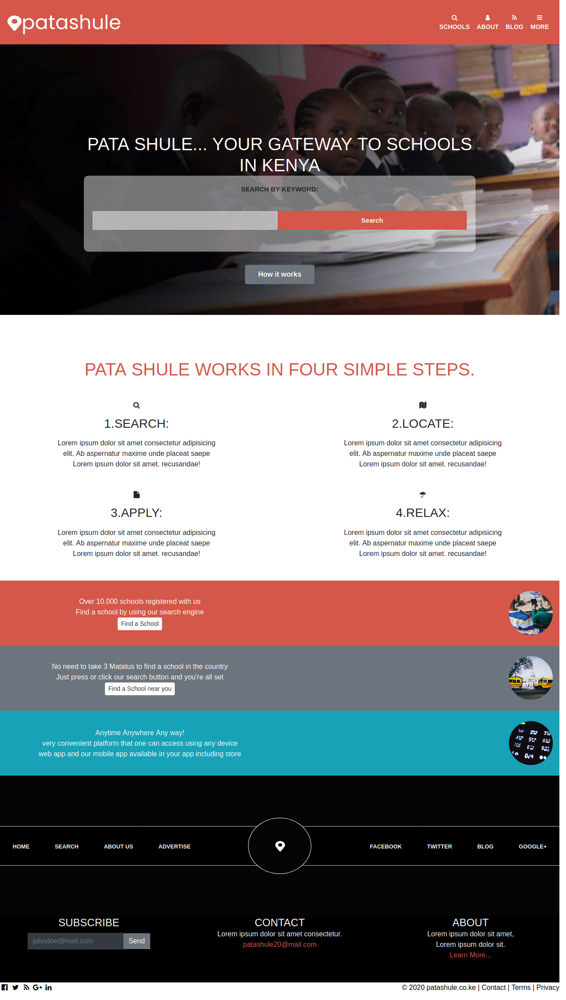

# DIRECTORY OF SCHOOLS CAPSTONE PROJECT

> The Capstone Project for completion of HTML & CSS Module.

<!-- Additional description about the project and its features. -->

- This project is the implementation of the PataShule directory of schools design using Bootstrap, HTML, CSS(box-model, flex-box, grid and ), github actions and netlify for hosting.

## Built With

- HTML5
- CSS3
- Bootstrap
- linters

## Live Demo

[Live Demo Link](https://patashule-capstone.netlify.app/)

## Getting Started

To get a local copy up and running follow these simple example steps.

- Fork the repository
- Git clone https://github.com/your-username/Capstone1-html
- git checkout -b branch name
- git remote add upstream https://github.com/jebitok-dev/Capstone1-html
- git pull upstream master
- git commit -m "commit message"
- git push -u origin HEAD

## Author

👤 **Author**

- GitHub: [@Jebitok-dev](https://github.com/Jebitok-dev)

## 🤝 Contributing

Contributions, issues, and feature requests are welcome!

Feel free to check the [issues page](issues/).

## Show your support

Give a ⭐️ if you like this project!

## Acknowledgments

- I hereby acknowldge the designers' [Mathew Njuguna](https://www.behance.net/mathewnjuguna) and [Sam Achola](https://www.behance.net/aweSam) who designed the [PataShule Directory of Schools](https://www.behance.net/gallery/25563385/PatashuleKE) design that is available on [behance](behance.com).
- Inspiration
- etc

<!-- ## 📝 License -->

<!-- This project is [MIT](lic.url) licensed. -->
